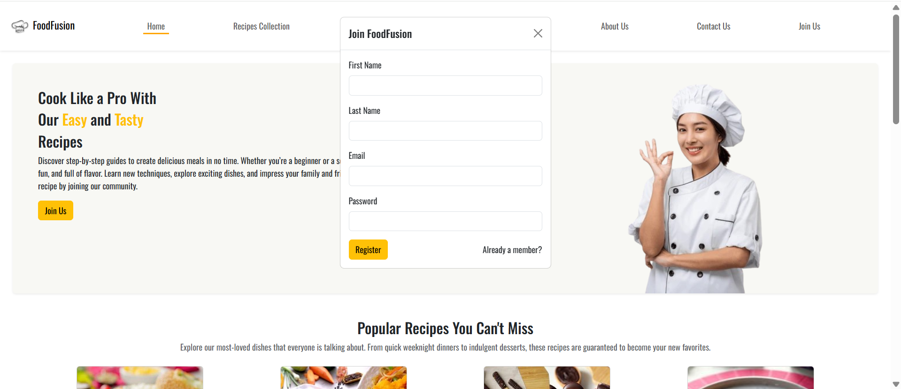
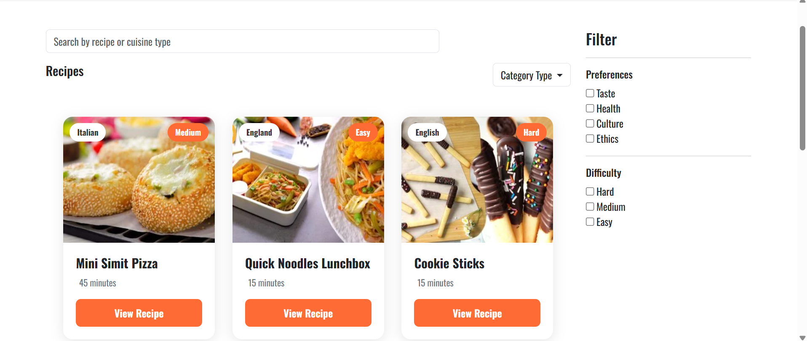
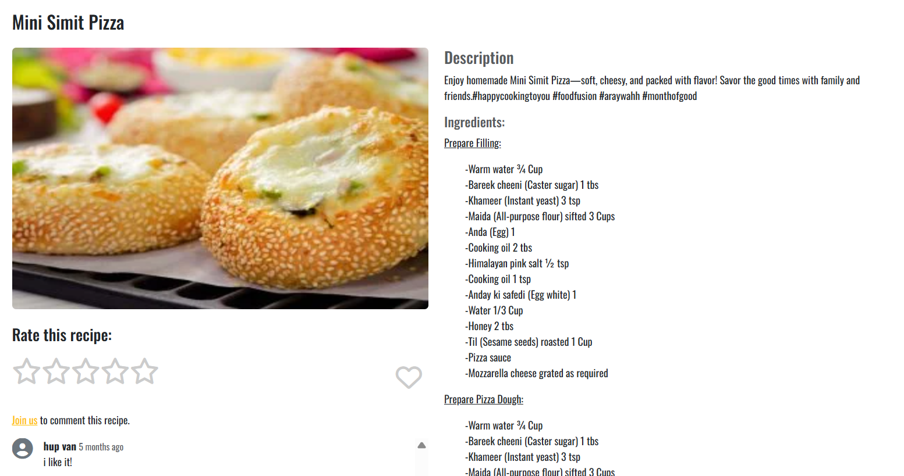
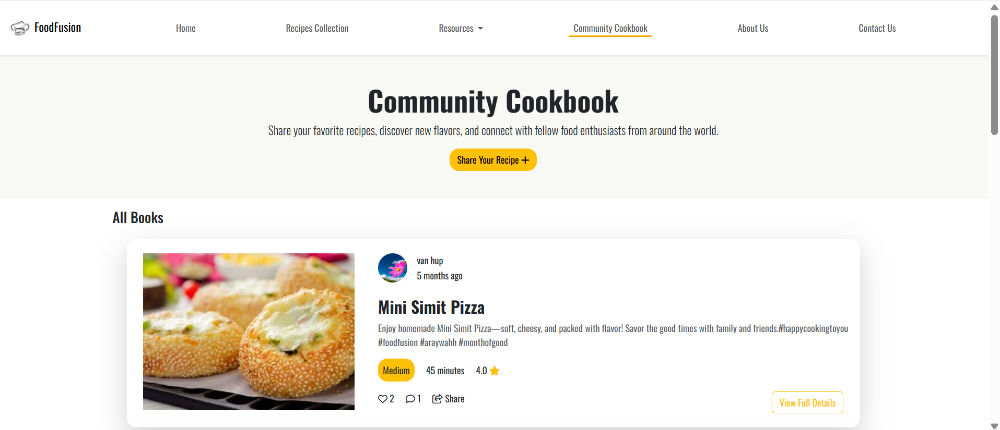
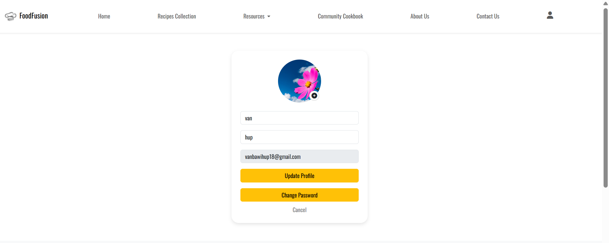
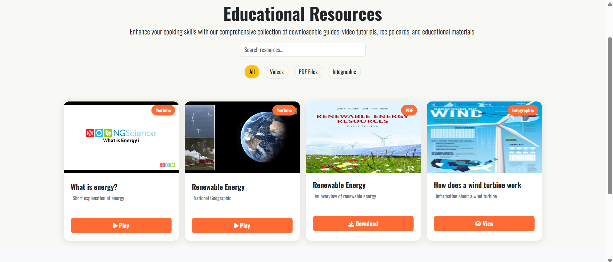
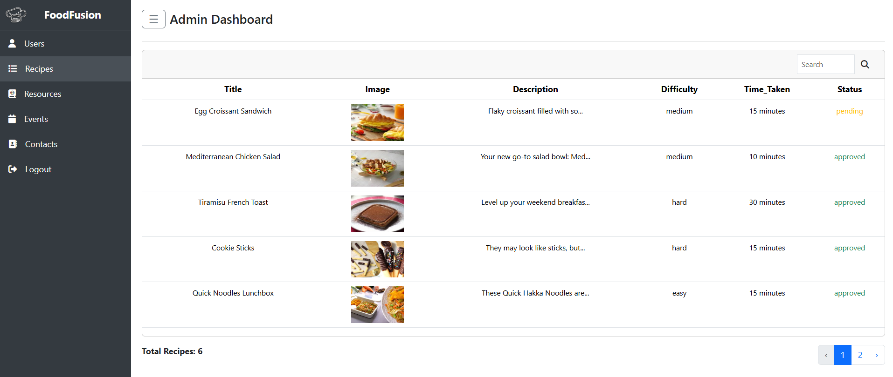

# Project Name
Food Fusion Website

## Description
Food Fusion is a Laravel-based web application where users can explore
different types of cuisines from around the world. Registered members can
share their own recipes, interact with the community through ratings and
comments, and access downloadable resources. The platform also includes an
admin panel for content moderation and event management.

## Tech Stack
- Laravel 11
- PHP
- MySQL
- Bootstrap
- JavaScript 

## Features

**User**
- User authentication (login & registration)
- Browse, search, and filter recipes
- Rate and comment on recipes
- Upload and share recipes
- Download resources (PDFs & videos)
- Form validation and error handling

**Admin**
- Approve or reject user-submitted recipes
- Manage downloadable resources (PDFs & videos)
- Create and manage events
- Content moderation

## Screenshots

### Home Page

### Recipe Collection

### Recipe Details

### Community Cook Book

### Account

### Resource

### Admin Dashboard

## Installation
1. Clone the repository
2. composer install
3. npm install
4. Copy `.env.example` to `.env`
5. php artisan key:generate
6. Configure database in `.env`
7. php artisan migrate --seed
8. php artisan serve

## Demo Admin Account
Email: admin@gmail.com  
Password: 12345678

## Architecture
- MVC pattern (Models, Views, Controllers)
- Laravel routing & middleware
- Blade templating engine
